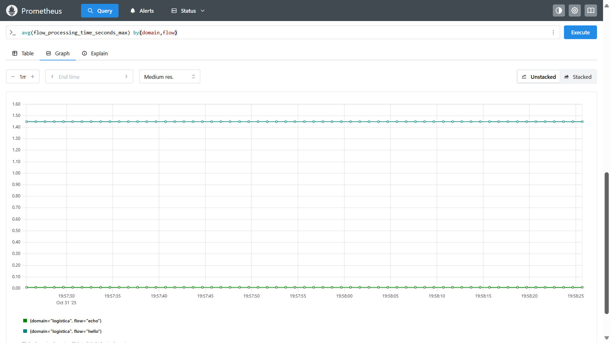
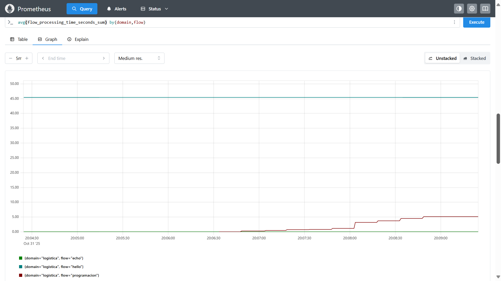
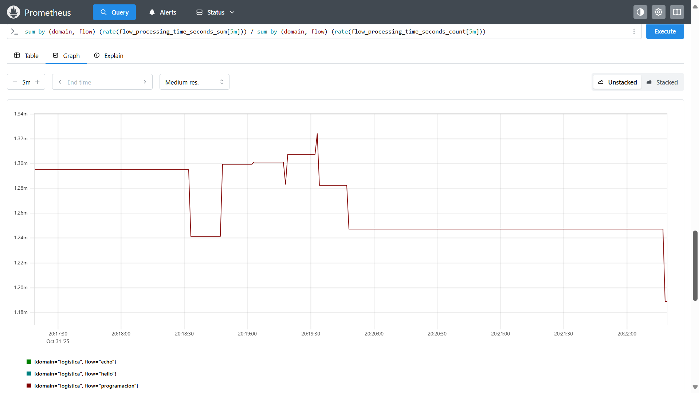
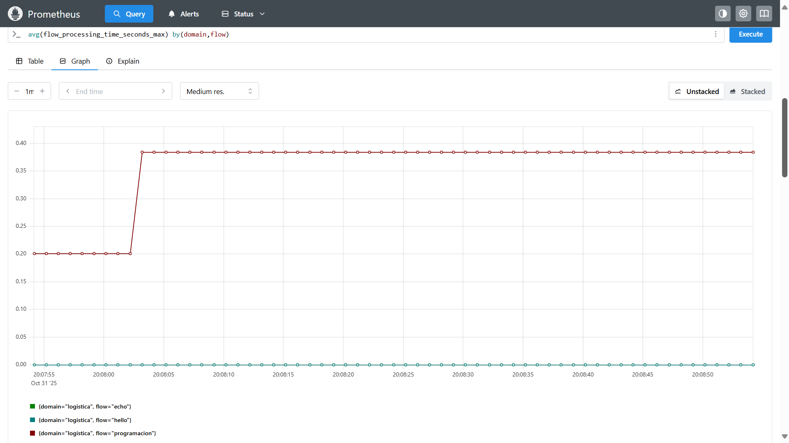
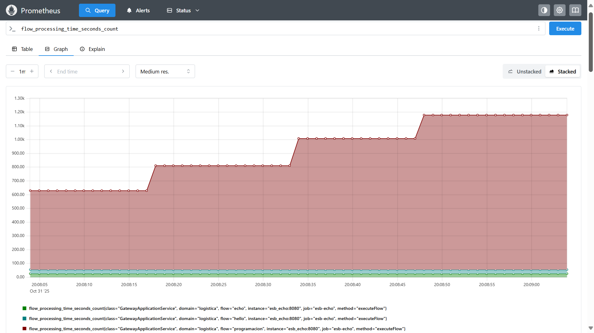

# Ejemplos Basicos

## Monitoreo Prometheus



### Metrica 1: Peticiones

```
sum(http_server_requests_seconds_count{uri="/gateway/api/v1/{domain}/{resource}"}) by(status,error)
```


### Metrica 2: Promedio de ejecucion

```
sum by (domain, flow) (rate(flow_processing_time_seconds_sum[5m])) / sum by (domain, flow) (rate(flow_processing_time_seconds_count[5m]))
```



### Metrica 3: Promedios (maximo)

```
avg(flow_processing_time_seconds_max) by(domain,flow)
```



### Metrica 4: Conteo acumulado en el tiempo

```
flow_processing_time_seconds_count
```

